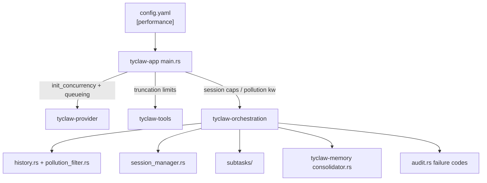
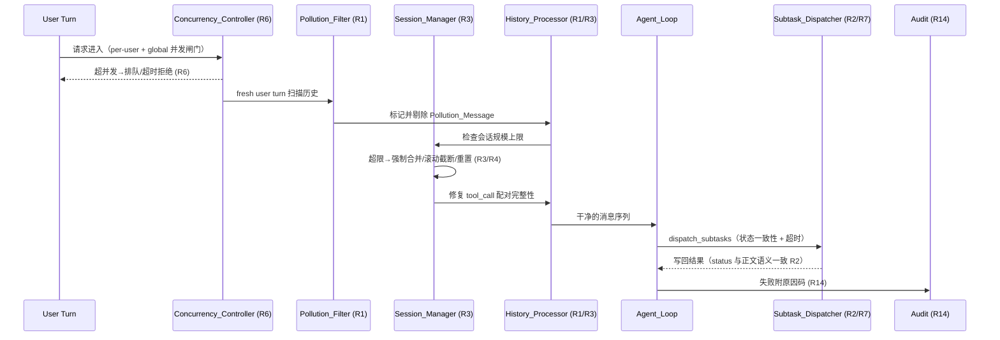

# Design Document

## Overview

本设计针对 `requirements.md` 中的 14 项需求，给出 tyclaw.rs「执行缓慢」问题的系统性技术方案。设计原则是**最大化复用现有结构、最小化侵入式重构**，所有阈值类参数以可配置项形式落地（统一收敛到一个新的 `[performance]` 配置段），便于线上调参。

### 问题归因与设计分层

通过对现有代码的校准，将 14 项需求归入四个治理层次：

| 层次 | 关注点 | 涉及需求 | 主要组件 |
|------|--------|---------|---------|
| **历史卫生（History Hygiene）** | 阻断污染复读、会话规模失控 | R1, R2, R3, R4 | `history.rs`, `session_manager.rs`, `subtasks/`, `consolidator.rs` |
| **资源治理（Resource Governance）** | 并发、超时、截断 | R5, R6, R7, R10 | `shell.rs`, `provider.rs`, `scheduler.rs`, `openai_compat.rs` |
| **快速失败（Fast Failure）** | 空结果、只读路径、配置缺失提前返回 | R8, R9 | `Sandbox`, 新增预检层 |
| **成本与可观测性（Cost & Observability）** | Prompt 压缩、依赖预装、分段返回、原因码 | R11, R12, R13, R14 | `compression.rs`, `Dockerfile`, `audit.rs` |

### 关键代码现状（设计依据）

- 全局 LLM 并发信号量**已存在**（`provider.rs::LLM_SEMAPHORE` + `init_concurrency`，默认 4），但**缺少排队超时、单用户并发上限、审计**。R6 在此之上扩展，不另起炉灶。
- SSE chunk 超时为**硬编码常量** `CHUNK_TIMEOUT_SECS = 90`（`openai_compat.rs`）；HTTP 层与 `chat_with_retry` 已有指数退避重试。R10 将其改为可配置 + 高并发动态阈值。
- `fresh user turn` reset 仅重置迭代计数器（`agent_loop.rs::take_reset_marker`），`history.rs`/`memory_filter.rs` **无污染剔除逻辑**。R1 新增 `pollution_filter` 模块。
- 子任务超时在 `scheduler.rs` 已有 per-node `tokio::time::timeout` 分支（产出 `NodeStatus::Failed + error:"timeout"`），但**无 dispatch 整体超时**，且 `NodeStatus` 枚举**无 `Blocked` 变体**。R2/R7 扩展。
- `consolidator.rs` 已有「最多 5 轮」(`MAX_ROUNDS=5`) 约束，但**按 token 预算合并、无单次消息数上限**。R4 增加分片体量上限。
- `shell.rs::MAX_OUTPUT_CHARS = 20_000` 当前为**纯头部截断**（仅保留前缀）。R5 改为头尾双段保留。
- matplotlib **未**在 `docker/sandbox/requirements.txt`（openpyxl 已在）。R12 补充。

## Architecture

### 配置统一入口

所有新增可配置项收敛到 `BaseConfig` 新增的 `performance: PerformanceConfig` 段，避免分散到各 crate。`PerformanceConfig` 在 `tyclaw-orchestration/src/config.rs` 定义，启动时由 `tyclaw-app/src/main.rs` 注入到 `Orchestrator`、`provider`（并发/SSE）、工具层（截断）。



### 请求生命周期中的新增关卡

在现有 14 步编排流程（`orchestrator.rs` 文档注释）基础上插入新的治理关卡：



### 新增 / 修改组件清单

| 组件 | 位置 | 动作 | 需求 |
|------|------|------|------|
| `PerformanceConfig` | `tyclaw-orchestration/src/config.rs` | 新增 | 全部 |
| `pollution_filter.rs` | `tyclaw-orchestration/src/` | 新增模块 | R1, R2 |
| `NodeStatus::Blocked` | `subtasks/protocol.rs` | 枚举扩展 | R2 |
| `node_status_to_declared_status()` | `subtasks/tool.rs` | 新增映射函数 | R2 |
| `SessionManager::enforce_size_limits()` | `session_manager.rs` | 新增 | R3 |
| `History_Processor::adjust_truncation_boundary()` | `history.rs` | 新增 | R3 |
| `MemoryConsolidator` 分片体量上限 | `consolidator.rs` | 修改 | R4 |
| `truncate_head_tail()` | `shell.rs` + `base.rs` | 替换 `truncate_by_chars` 调用 | R5 |
| `Concurrency_Controller` | `tyclaw-provider/src/concurrency.rs` | 扩展现有信号量 | R6 |
| dispatch 整体超时 | `subtasks/scheduler.rs` | 新增 | R7 |
| `PrecheckLayer`（可写性/配置可达性） | `tyclaw-tools` / `Sandbox` | 新增 | R8 |
| Empty_Result 快速返回 | `subtasks` / skill 协议 | 新增 | R9 |
| SSE 动态超时 | `openai_compat.rs` | 修改 | R10 |
| tool schema 精简 + token 占比指标 | `compression.rs` / prompt 层 | 修改 | R11 |
| matplotlib 预装 | `docker/sandbox/requirements.txt` | 修改 | R12 |
| 分段返回 + 缓存 TTL | skill 协议 / `tyclaw-tools` | 新增 | R13 |
| `FailureCode` 枚举 + 慢请求统计 | `tyclaw-control/src/audit.rs` | 新增 | R14 |

## Components and Interfaces

### 1. Pollution Filter（R1, R2）

新增 `tyclaw-orchestration/src/pollution_filter.rs`，提供纯函数化的污染识别与剔除，便于属性测试。

```rust
/// 污染判定配置（来自 PerformanceConfig）。
pub struct PollutionConfig {
    /// 污染关键词集合，默认 ["I cannot make progress", "error", "blocked"]
    pub keywords: Vec<String>,
    /// 污染候选短消息字符上限，默认 512
    pub short_message_max_chars: usize,
}

/// 判定单条消息是否为污染候选。
/// 条件（全部满足）：role==tool；字符长度 <= short_message_max_chars；
/// 以不区分大小写的"完整短语"方式匹配至少一个关键词。
pub fn is_pollution_candidate(msg: &HashMap<String, Value>, cfg: &PollutionConfig) -> bool;

/// 剔除结果。
pub struct PollutionFilterResult {
    pub cleaned: Vec<HashMap<String, Value>>,
    pub removed_count: usize,
    /// 被补齐占位 tool_result 的 tool_call_id 列表
    pub placeholder_ids: Vec<String>,
}

/// 扫描并剔除污染消息，剔除后补齐占位 tool_result 维持配对完整性。
/// 占位 tool_result 内容含可识别标识 "[pollution-removed]"。
/// 保留所有非污染消息，内容与相对顺序不变。
pub fn filter_pollution(
    history: &[HashMap<String, Value>],
    cfg: &PollutionConfig,
) -> PollutionFilterResult;
```

**集成点**：在 `orchestrator.rs` 处理 fresh user turn 时（`take_reset_marker` 命中或新 user 消息进入），于 build prompt 前调用 `filter_pollution`，随后照常走 `enforce_tool_call_pairing`。剔除数量（含 0）写入审计（R1.5）。

**关键词匹配语义（R1.7）**：「完整短语」指关键词作为一个连续子串出现（不区分大小写），而非要求整条消息等于关键词。例如关键词 `"blocked"` 命中 `"task blocked by readonly fs"`，但 `"error"` 作为词的匹配采用大小写不敏感的 `contains`（满足报告中 `error` 兜底文案场景）。短语整体匹配避免把 `"errorless"` 之类误判——通过对关键词做 trim 后的子串匹配 + 短消息长度上限双重约束控制误杀。

### 2. Subtask Status Consistency（R2）

扩展 `subtasks/protocol.rs`：

```rust
pub enum NodeStatus {
    Pending, Running, Success, Failed, Blocked, Skipped,  // 新增 Blocked
}
```

在 `executor.rs` 节点完成时，对 `output` 做污染检测（复用 `pollution_filter::contains_pollution_phrase`）：

```rust
/// 根据输出正文与终止原因校正节点状态。
/// - 正文含 Pollution_Keyword → Failed/Blocked（绝不 Success）
/// - 命中 max_iterations 且正文空白或含污染词 → Failed
fn reconcile_node_status(raw: NodeStatus, output: &str, hit_max_iter: bool, cfg: &PollutionConfig) -> NodeStatus;
```

在 `tool.rs` 写回主会话时，新增显式映射函数取代当前从正文 `Status:` 行解析的 `extract_declared_result_status`：

```rust
/// NodeStatus → declared_result_status 语义映射（R2.3, R2.6）。
/// Success→"success"；Failed/Blocked/Skipped→"failed"（绝不为成功语义）。
fn node_status_to_declared_status(status: NodeStatus) -> &'static str;
```

失败节点在 `DispatchNodeSummary` 中以独立字段 `failure_reason: Option<String>` 承载失败原因（R2.4/R2.5），与正文 `output` 文本分离，且无论是否有其他错误上下文都填充。

### 3. Session Size Limits（R3）

`SessionManager` 新增 `enforce_size_limits`，在 `get_or_create_clone` 后、build prompt 前调用：

```rust
pub struct SizeLimitConfig {
    pub max_messages: usize,            // 默认 500
    pub rolling_target: usize,          // 默认 400 (= 80%)
    pub pairs_fixes_warn: usize,        // 默认 30
    pub pairs_fixes_force_reset: usize, // 默认 60
}

pub enum SizeLimitAction {
    None,
    ForcedConsolidation { merged: usize },
    RollingTruncation { kept: usize },
    ForcedReset { kept_last_turn: usize },
}

/// 超限处理（顺序：强制合并 → 仍超限则滚动截断；Pairs_Fixes 超 reset 阈值则强制重置）。
pub async fn enforce_size_limits(
    session: &mut Session,
    pairs_fixes: usize,
    cfg: &SizeLimitConfig,
    consolidator: &MemoryConsolidator,
    /* provider/model */
) -> SizeLimitAction;
```

截断/重置后，`history.rs` 新增 `adjust_truncation_boundary` 保证保留窗口不以孤立 tool_result 开头（R3.6/R3.7）——若保留窗口最早一条是缺失对应 tool_call 的孤立 tool_result，则将边界向更早方向回退至最近一个完整 user turn 起点：

```rust
/// 给定保留窗口起始下标，向更早方向调整到不以孤立 tool_result 开头的、
/// 最近一个完整 user turn 的起点。返回调整后的起始下标。
pub fn adjust_truncation_boundary(messages: &[HashMap<String, Value>], start: usize) -> usize;
```

所有 size-limit 动作写审计含触发原因与 workspace（R3.8）。

### 4. Memory Consolidation Cap（R4）

`MemoryConsolidator` 在按 token 预算合并之外，增加单批最大消息数约束。修改 `pick_consolidation_boundary` 的调用方，使每个分片在「不拆分单个 user turn」前提下消息数 ≤ `max_messages_per_batch`（默认 500）；保留现有 `MAX_ROUNDS=5` 作为单次调用分片上限（R4.3）。

```rust
pub struct ConsolidationConfig {
    pub max_messages_per_batch: usize, // 默认 500
    pub max_rounds: usize,             // 默认 5（沿用 MAX_ROUNDS）
}

/// 在 [last_consolidated, end) 内按 user turn 边界切出一个不超过 max_messages 的批次。
/// 返回该批次的结束下标（user turn 对齐）。
pub fn pick_batch_boundary(
    messages: &[HashMap<String, Value>],
    last_consolidated: usize,
    max_messages: usize,
) -> usize;
```

失败批次处理（R4.6）：某批次 `consolidate_with_provider` 返回 false 时，停止后续批次、保留该批及之后为未合并、记录失败批次序号与原因；达到 5 批上限仍有剩余则保留未合并（R4.5）。每次合并完成记录处理消息数与批次数（R4.4）。

### 5. Tool Output Limiter（R5）

在 `shell.rs`（exec）与 grep_search 输出路径替换纯头部截断为头尾双段保留。新增共享函数（放 `base.rs` 供复用）：

```rust
/// 头尾双段截断：保留头部段 + 尾部段，总字符数 <= max_chars，
/// 尾部段 >= max_chars * tail_ratio（默认 0.25）。
/// 中间插入截断标记，标明省略的中间字符数。
/// 输入长度 <= max_chars 时原样返回，不加标记。
pub fn truncate_head_tail(text: &str, max_chars: usize, tail_ratio: f64) -> String;
```

配置：`exec_truncate_chars`（默认 20000，下限 8000）、`grep_truncate_chars`（默认 20000，下限 8000）。`read_file` 的 `MAX_READ_CHARS=128_000` 保持不变（R5.5）。下限通过配置加载时 `clamp` 到 ≥8000 强制。

### 6. Concurrency Controller（R6）

扩展 `tyclaw-provider` 现有全局信号量为完整的 `Concurrency_Controller`（独立模块 `concurrency.rs`）：

```rust
pub struct ConcurrencyConfig {
    pub global_max_inflight: usize,   // 全局 in-flight 上限（沿用 init_concurrency）
    pub per_user_max_inflight: usize, // 默认 3
    pub queue_timeout: Duration,      // 默认 5 分钟
}

/// 获取一个执行许可；超并发则排队，排队超过 queue_timeout 返回 Busy 错误。
/// 同时受 global 与 per-user 两级闸门约束。
pub async fn acquire_permit(user_id: &str) -> Result<Permit, ConcurrencyError>;

pub enum ConcurrencyError {
    /// 排队超时（全局或单用户）
    QueueTimeout { limit_kind: LimitKind },
}
pub enum LimitKind { Global, PerUser }
```

实现：全局沿用 `Semaphore`；per-user 用 `HashMap<String, Arc<Semaphore>>`。`acquire` 用 `tokio::time::timeout(queue_timeout, sem.acquire())` 实现排队超时（R6.3/R6.5）。排队/拒绝时写审计含 user_id 与 `limit_kind`（R6.6）。`chat_with_retry` 内 `get_semaphore().acquire()` 改为调用此控制器（per-user 维度需把 user_id 通过 `cache_scope` 或 task_local 传入）。

### 7. Subtask Chain Timeout（R7）

`scheduler.rs` 已有 per-node 超时；新增：
- per-node 最大执行时间配置 `node_max_duration`（默认 ≤5 分钟），覆盖 `default_timeout_ms` 上限：`effective = min(node.timeout_ms.unwrap_or(default), node_max_duration)`。
- dispatch 整体超时 `dispatch_max_duration`：在 `DagScheduler::execute` 外层包 `tokio::time::timeout`，超时则终止未完成 node、对其记 `NodeStatus::Failed + error:"chain_timeout"`，返回已完成 node 的部分结果（R7.4）。返回结果标明哪些 node 完成、哪些超时终止（R7.5）。

### 8. Sandbox Precheck（R8）

新增预检层。两类预检均为「先检查、失败即返回可识别错误并停止重复尝试」：

- **可写性预检（R8.1/R8.2）**：写/编辑工具（`write_file`/`edit_file`/`apply_patch`）执行前对目标路径做可写性探测（父目录存在且可写 / 目标文件非只读）。只读返回 `Error: readonly_path: <path>`。同一 turn 内对同一只读路径的二次写入直接短路返回缓存的错误（用 per-turn `HashSet<PathBuf>` 记忆已知只读路径）。
- **配置可达性预检（R8.3/R8.4）**：Sandbox 启动执行依赖配置文件的脚本前，校验约定路径（如 `.config/ty.config.toml`）可达。缺失返回 `Error: config_missing: <path>` 并记入 per-turn 已知缺失集合，阻断重复探查。
- **Skill 路径稳定解析（R8.5）**：定时 Skill 通过 glob/别名解析定位，路径变动仍命中（在 `skill_manager.rs` 解析时用 glob pattern 而非硬编码路径）。

### 9. Empty Result Fast Return（R9）

在查询类 skill 协议中约定：首次数据源调用返回 0 行时输出可识别标记（如结构化 `{"rows": 0}`）。编排层识别后：

```rust
pub struct EmptyResultConfig { pub fast_return_secs: u64 } // 默认 30

/// 判定是否 Empty_Result_Task：首次数据源调用 0 行有效数据。
fn is_empty_result(first_call_rows: usize) -> bool;
```

识别为 Empty_Result_Task 后，在 `fast_return_secs` 内返回「无匹配数据」提示并跳过后续文件生成/发送（R9.2/R9.4）；时限到期仍未发出则到期后补发提示（R9.3）；首次非空则照常执行（R9.5）。

### 10. SSE Dynamic Timeout（R10）

`openai_compat.rs` 将 `CHUNK_TIMEOUT_SECS` 常量改为运行期可配置 + 动态：

```rust
pub struct SseConfig {
    pub chunk_timeout_secs: u64,            // 基线，默认 90
    pub high_concurrency_timeout_secs: u64, // 默认 150
    pub high_concurrency_inflight: usize,   // 触发动态提升的 in-flight 阈值
    pub max_retries: usize,
}

/// 依据当前 in-flight 数选择 chunk 超时阈值。
fn effective_chunk_timeout(cfg: &SseConfig, current_inflight: usize) -> Duration;
```

高并发（in-flight > 阈值）时用 `high_concurrency_timeout_secs`（R10.2）。已开始接收数据后超时走指数退避重试（沿用 `chat_with_retry` + HTTP 层重试，R10.3）。周期性心跳帧维持连接（R10.4）——agent_loop 已有 90s 心跳机制，此处在 SSE 等待期补发。重试达上限返回「请稍后重试」类提示而非失败兜底（R10.5）。

### 11. Prompt Token Compression（R11）

- 工具 schema 精简：提供 `compact` 模式的工具定义（去除冗长 description、示例），使发送 token < 精简前（R11.1）。
- 历史超预算时沿用 `trim_history_by_token_budget`（R11.2，已存在）。
- 新增 token 占比观测：每次请求记录 history/cases/skills/tool 定义各部分 token（R11.3），写入 progress/审计指标。
- 稳定前缀缓存：`identity + bootstrap files + MEMORY.md 指纹` 未变时复用缓存前缀（R11.4），复用现有 `cache_scope`/`cache_breakpoint_idx` 机制 + 指纹比对。

### 12. Skill Dependency Preinstall（R12）

`docker/sandbox/requirements.txt` 增加 `matplotlib`（openpyxl 已存在）。预装后首次运行不触发 pip install（R12.2）；未预装依赖仍允许运行时安装（R12.3）。此为镜像构建配置变更。

### 13. Long-Chain Skill Segmented Return & Caching（R13）

- 分段返回：含「文本结果 + 附件」两类产出的任务，先发文本再发附件（R13.1）。
- 可缓存中间结果（如前一日持仓）提供可配置 TTL 缓存（R13.2），未过期则复用（R13.3）。
- 子步骤超过步骤超时则终止并返回已完成部分（R13.4）。

```rust
pub struct StepCache { /* key -> (value, expires_at) */ }
impl StepCache {
    pub fn get(&self, key: &str, now: Instant) -> Option<&CachedValue>; // 过期返回 None
    pub fn put(&mut self, key: &str, val: CachedValue, ttl: Duration, now: Instant);
}
```

### 14. Failure Codes & Observability（R14）

`tyclaw-control/src/audit.rs` 新增：

```rust
pub enum FailureCode {
    HitMaxIterations, SseTimeout, PollutionReplay, SubtaskTimeout,
    EmptyResult, ReadonlyPath, ConfigMissing,
}

/// 同 turn 同时命中 SSE 超时与 max_iterations 时，sse_timeout 优先（R14.3）。
fn resolve_priority(codes: &[FailureCode]) -> FailureCode;
```

失败结果在审计附原因码（R14.1）；`max_iterations` 重置以 WARN 记录含 workspace（R14.2）；同 turn 冲突时 `sse_timeout` 优先并返回「请稍后重试」（R14.3）；记录每日慢请求（超可配置耗时阈值）原因码分布（R14.4）。

## Data Models

### PerformanceConfig（新增统一配置）

```rust
#[derive(Debug, Clone, Deserialize)]
pub struct PerformanceConfig {
    pub pollution: PollutionConfig,         // R1/R2
    pub session_limits: SizeLimitConfig,    // R3
    pub consolidation: ConsolidationConfig, // R4
    pub truncation: TruncationConfig,       // R5
    pub concurrency: ConcurrencyConfig,     // R6
    pub subtask_timeout: SubtaskTimeoutConfig, // R7
    pub empty_result: EmptyResultConfig,    // R9
    pub sse: SseConfig,                     // R10
    pub slow_request_threshold_secs: u64,   // R14.4
}
```

每个子结构均实现 `Default`，缺省值即需求中的默认值；加载时对有下限约束的字段（如截断下限 8000、并发≥1）做 `clamp`。

### PollutionFilterResult / SizeLimitAction / NodeStatus

见上文 Components 各接口定义。核心不变量：
- `filter_pollution` 输出的 `cleaned` 中，每个 `role==tool` 的消息要么非污染，要么是占位 tool_result；且不存在缺失对应 tool_call 的孤立 tool_result。
- `NodeStatus` 增加 `Blocked`；所有非 `Success` 状态映射到失败语义的 `declared_result_status`。

### FailureCode 审计记录

```rust
pub struct FailureAuditEntry {
    pub workspace_key: String,
    pub failure_code: FailureCode,
    pub turn_id: String,
    pub duration_ms: u64,
}
```

## Correctness Properties

*A property is a characteristic or behavior that should hold true across all valid executions of a system—essentially, a formal statement about what the system should do. Properties serve as the bridge between human-readable specifications and machine-verifiable correctness guarantees.*

经过 prework 分析与属性反思（合并 1.2+1.4 配对、2.3+2.6 映射、2.4+2.5 失败原因、5.1+5.2 下限 clamp、8.2+8.4 去重短路），下列性质覆盖所有可属性化的验收标准。配置默认值类（1.3/3.1/4.1/5.5/6.1/6.4/7.1/7.3/10.1/13.2）以及并发/时序/沙盒类（6.2/6.3/6.5/7.2/7.4/8.1/8.3/9.2/9.3/10.3/10.4/11.3/12.x/13.4/14.2/14.4）走示例/集成/烟雾测试，不在此列。

### Property 1: 污染候选判定等价于三条件合取

*For any* tool/assistant/user 消息与 `PollutionConfig`，`is_pollution_candidate` 返回 true 当且仅当三条件同时满足：role 为 tool、字符长度 ≤ `short_message_max_chars`、以不区分大小写的完整短语方式匹配至少一个 `Pollution_Keyword`。fresh user turn 扫描标记的集合恰为满足该谓词的 tool 消息子集。

**Validates: Requirements 1.1, 1.7**

### Property 2: 污染剔除保持配对完整性并补齐占位

*For any* 历史消息序列，`filter_pollution` 输出的序列中不存在缺失对应 tool_call 的孤立 tool_result；凡因剔除污染 tool_result 而失去结果的 tool_call，均被补齐含可识别标识 `[pollution-removed]` 的占位 tool_result（而非保留原污染消息）。

**Validates: Requirements 1.2, 1.4**

### Property 3: 非污染消息内容与顺序原样保留

*For any* 历史消息序列，从 `filter_pollution` 输出中剔除占位 tool_result 后所得的非污染消息子序列，与输入中所有非污染消息的子序列逐项相等（内容与相对顺序均不变）。

**Validates: Requirements 1.6**

### Property 4: 污染剔除审计计数准确（含 0）

*For any* 历史消息序列，`filter_pollution` 恰好产生一条审计记录，其 `removed_count` 等于实际被剔除的污染消息数量（当无污染时该值为 0 且仍记录），且含该 Workspace 标识。

**Validates: Requirements 1.5**

### Property 5: 污染/撞顶节点状态绝不判为成功

*For any* 节点输出正文与终止标志，`reconcile_node_status`：若正文（不区分大小写）含 Pollution_Keyword 则结果属于 {Failed, Blocked} 且绝不为 Success；若命中 max_iterations 且正文为空白或含 Pollution_Keyword 则结果为 Failed。

**Validates: Requirements 2.1, 2.2**

### Property 6: 状态到声明状态的映射保持失败语义

*For any* `NodeStatus`，`node_status_to_declared_status`：仅当输入为 `Success` 时返回成功语义值；对 `Failed`、`Blocked`、`Skipped` 均返回失败/受阻语义，绝不返回成功语义值（如 `ok`/`success`）。

**Validates: Requirements 2.3, 2.6**

### Property 7: 失败节点始终附带独立失败原因

*For any* 实际状态为 `Failed` 或 `Blocked` 的执行记录，其写回的 `DispatchNodeSummary.failure_reason` 始终非空且独立于正文文本，无论系统是否已通过其他途径提供错误上下文。

**Validates: Requirements 2.4, 2.5**

### Property 8: 强制合并边界自最早消息按时序推进

*For any* 超过硬上限的会话，强制记忆合并选取的边界从最早的未合并消息开始、按时间顺序向后推进（边界落在 user turn 起点）。

**Validates: Requirements 3.2**

### Property 9: 滚动截断回落至目标水位以内

*For any* 合并后仍超硬上限的会话，滚动截断后保留的消息数 ≤ `rolling_target`（默认 400）。

**Validates: Requirements 3.3**

### Property 10: Pairs_Fixes 阈值触发对应动作

*For any* `pairs_fixes` 取值与会话：当 `pairs_fixes` > 告警阈值（默认 30）时触发 WARN 记录；当 `pairs_fixes` > 强制重置阈值（默认 60）时返回 `ForcedReset` 且保留序列以最近一个完整 user 回合起点（首条为 user 消息）。

**Validates: Requirements 3.4, 3.5**

### Property 11: 截断边界调整后不以孤立 tool_result 开头

*For any* 消息序列与候选起始下标 `start`，`adjust_truncation_boundary` 返回的下标 ≤ `start`，且其所指消息不是缺失对应 tool_call 的孤立 tool_result（为 user 消息或完整 user 回合起点）。

**Validates: Requirements 3.7**

### Property 12: 截断/重置后保持配对完整性

*For any* 会话，执行滚动截断或强制重置后，保留序列中 tool_call 与 tool_result 配对完整，不存在缺失对应 tool_call 的孤立 tool_result。

**Validates: Requirements 3.6**

### Property 13: size-limit 动作审计原因与动作一致

*For any* 触发的 size-limit 动作（强制合并 / 滚动截断 / 强制重置），审计记录的触发原因与实际动作类型一致，且含 Workspace 标识。

**Validates: Requirements 3.8**

### Property 14: 合并分片不超上限且不拆分 user turn

*For any* 待合并消息序列与 `max_messages_per_batch`，`pick_batch_boundary` 切出的每个批次消息数 ≤ 该上限，且批次边界落在 user turn 边界上（不拆分单个 user turn）。

**Validates: Requirements 4.2**

### Property 15: 单次合并调用至多处理 5 个分片批次

*For any* 任意大的未合并序列，单次记忆合并调用处理的分片批次数 ≤ 5。

**Validates: Requirements 4.3**

### Property 16: 达批次上限后剩余消息保留为未合并

*For any* 处理批次数达到 5 的合并调用，合并后的 `last_consolidated` 恰好等于第 5 批的结束下标，剩余消息的合并边界不被推进。

**Validates: Requirements 4.5**

### Property 17: 分片失败停止后续并保留未合并

*For any* 在第 k 批失败的合并调用，合并停止于第 k 批之前，`last_consolidated` 仅推进到第 k 批起点（失败批及其之后保留为未合并），并记录失败批次序号与原因。

**Validates: Requirements 4.6**

### Property 18: 截断上限配置被 clamp 到下限以上

*For any* 加载的截断配置值，`exec_truncate_chars` 与 `grep_truncate_chars` 经 clamp 后均 ≥ 8000。

**Validates: Requirements 5.1, 5.2**

### Property 19: 头尾双段截断满足总量与尾段比例约束

*For any* 文本与截断上限 `max`（`max ≥ 8000`），当文本字符数 > `max` 时，`truncate_head_tail` 输出（不含截断标记）保留字符总数 ≤ `max`，且尾部保留段字符数 ≥ `max * 0.25`。

**Validates: Requirements 5.3**

### Property 20: 截断标记标明正确的省略字符数

*For any* 超过上限的文本，`truncate_head_tail` 输出在头尾段间插入截断标记，标记标明的省略中间字符数等于（原字符数 − 保留头尾段字符数）。

**Validates: Requirements 5.4**

### Property 21: 未超上限时截断为恒等操作

*For any* 字符数 ≤ 上限的文本，`truncate_head_tail` 返回与输入完全相等的字符串且不附加任何截断标记。

**Validates: Requirements 5.6**

### Property 22: 并发拒绝审计记录上限类型与用户

*For any* 因并发上限被排队或拒绝的请求，审计记录含正确的 `limit_kind`（Global / PerUser）与 `user_id`。

**Validates: Requirements 6.6**

### Property 23: 子任务超时结果正确分类每个节点

*For any* 部分完成、部分超时终止的节点记录集，返回结果对每个 Node 标明其为「已完成」或「因超时被终止」，分类与各记录实际状态一致。

**Validates: Requirements 7.5**

### Property 24: 已知只读/缺失路径短路重复探查

*For any* 路径探查序列，一旦某路径被判定为只读（或配置缺失）并记入 per-turn 已知集合，对同一路径的后续探查直接返回一致的 `readonly_path`（或 `config_missing`）错误，不再触发实际文件系统探测。

**Validates: Requirements 8.2, 8.4**

### Property 25: Skill 路径稳定解析命中变体

*For any* 符合既定 glob/别名模式的 Skill 路径变体，路径解析均能命中目标 Skill（路径变动时仍命中）。

**Validates: Requirements 8.5**

### Property 26: 空结果判定等价于零行

*For any* 首次数据源调用返回的有效行数 `n`，`is_empty_result(n)` 返回 true 当且仅当 `n == 0`。

**Validates: Requirements 9.1**

### Property 27: 空结果任务返回提示后跳过后续生成

*For any* 被识别为 Empty_Result_Task 并已返回「无匹配数据」提示的任务流程，后续文件生成与发送步骤的执行次数为 0。

**Validates: Requirements 9.4**

### Property 28: chunk 超时阈值随并发单调选择

*For any* 当前 in-flight 数与 `SseConfig`，`effective_chunk_timeout`：当 in-flight > `high_concurrency_inflight` 时返回 `high_concurrency_timeout_secs`，否则返回 `chunk_timeout_secs`；且 `high_concurrency_timeout_secs ≥ chunk_timeout_secs`。

**Validates: Requirements 10.2**

### Property 29: 重试耗尽返回稍后重试提示而非兜底文案

*For any* 持续失败至重试上限的 SSE 流，最终返回给用户的内容为可识别的「请稍后重试」类提示，且不含失败兜底文案（如 `I cannot make progress`）。

**Validates: Requirements 10.5**

### Property 30: 精简工具 schema 的 token 量低于原始

*For any* 工具定义集合，其精简表示的估算 token 量严格小于原始表示的估算 token 量。

**Validates: Requirements 11.1**

### Property 31: 历史裁剪结果不超 token 预算

*For any* 历史序列与正数 token 预算，`trim_history_by_token_budget` 的结果估算 token 量 ≤ 预算（在预算允许时至少保留一条最近消息）。

**Validates: Requirements 11.2**

### Property 32: 稳定前缀缓存命中当且仅当指纹全等

*For any* 两次请求的（identity, bootstrap files, MEMORY.md）指纹三元组，缓存前缀被复用当且仅当三者全部相等。

**Validates: Requirements 11.4**

### Property 33: 文本结果先于附件返回

*For any* 同时包含文本结果与附件产出的任务，文本结果的发送顺序先于任何附件产出。

**Validates: Requirements 13.1**

### Property 34: 步骤缓存遵循 TTL 语义

*For any* 缓存键、值、TTL 与查询时刻，`StepCache.get` 在未过期（now < expires_at）时返回先前 `put` 的值，过期后返回 `None`。

**Validates: Requirements 13.3**

### Property 35: 失败审计始终携带合法原因码

*For any* 向用户返回的失败结果，审计记录的 `failure_code` 非空且取值属于预定义集合 {hit_max_iterations, sse_timeout, pollution_replay, subtask_timeout, empty_result, readonly_path, config_missing}。

**Validates: Requirements 14.1**

### Property 36: SSE 超时优先于撞顶

*For any* 同一 turn 命中的原因码集合，当其同时包含 `SseTimeout` 与 `HitMaxIterations` 时，`resolve_priority` 返回 `SseTimeout`。

**Validates: Requirements 14.3**

## Error Handling

### 错误传播与原因码

所有可向用户暴露的失败统一经 `FailureCode` 归类并写审计（R14）。错误处理遵循「快速失败、可识别、不污染」三原则：

- **可识别错误**：只读路径、配置缺失、并发繁忙、超时、空结果均返回带显式前缀的错误（`readonly_path:`/`config_missing:`/`busy`/`timeout`/`empty_result`），供编排层归类原因码并短路重复尝试。
- **不污染历史**：失败兜底文案（`I cannot make progress` 等）不得以 `Success` 身份写回主会话（R2）；SSE 重试耗尽返回「请稍后重试」而非兜底文案（R10.5/R14.3）。
- **占位修复**：剔除污染或截断会话破坏配对时，以占位 tool_result 修复而非丢弃，避免上游 provider 400（沿用现有 `ensure_tool_call_pairs` 分层设计）。

### 降级策略

| 场景 | 降级行为 |
|------|---------|
| 记忆合并某批失败（R4.6） | 停止后续批次，保留未合并，下次触发续作 |
| dispatch 整体超时（R7.4） | 返回已完成 node 部分结果，标注超时终止的 node |
| 并发排队超时（R6.3/R6.5） | 返回「繁忙/请稍后重试」，写审计 |
| 空结果任务（R9） | 30s 内返回「无匹配数据」，跳过生成 |
| SSE 重试耗尽（R10.5） | 返回「请稍后重试」提示 |

### 配置健壮性

`PerformanceConfig` 加载失败或字段越界时回退到 `Default`，并对有下限/上限约束的字段（截断 ≥8000、并发 ≥1、node 超时 ≤5min）做 `clamp`，保证非法配置不会破坏运行。

## Testing Strategy

### 双轨测试方法

- **单元测试 / 示例测试**：覆盖配置默认值（1.3/3.1/4.1/5.5/6.1/6.4/7.1/7.3/10.1）、具体分支（9.5/13.2）。
- **集成测试（1–3 例）**：覆盖并发排队与超时（6.2/6.3/6.5）、node 与 dispatch 超时时序（7.2/7.4）、沙盒可写性与配置可达（8.1/8.3）、空结果时序（9.2/9.3）、SSE 重试与心跳（10.3/10.4）、token 占比指标（11.3）、子步骤超时（13.4）、迭代重置 WARN 与慢请求统计（14.2/14.4）。这些行为不随输入显著变化或依赖外部/时间，运行 100 次无额外收益。
- **烟雾测试（单次）**：镜像依赖预装（12.1/12.2），构建后 import 验证。
- **属性测试（100+ 次迭代）**：覆盖上文 36 条 Correctness Properties。

### 属性测试配置

- 目标语言为 Rust，采用 **`proptest`** 库（不自行实现属性测试框架）。
- 每个属性测试最少运行 **100** 次迭代（`ProptestConfig { cases: 100, .. }`）。
- 每个属性测试以注释标注其对应设计属性，格式：
  `// Feature: execution-performance-optimization, Property {number}: {property_text}`
- 每条 Correctness Property 由**单个**属性测试实现。

### 生成器要点

- **历史消息生成器**：生成含 user/assistant(tool_calls)/tool(tool_call_id) 的随机轮次序列，覆盖配对完整、孤立 tool_result、连续 assistant、图片插入 user 等边界（服务 P1/P2/P3/P11/P12/P31）。
- **污染内容生成器**：随机注入大小写混合的关键词、超长/短消息、`errorless` 等近似词，验证完整短语匹配与短消息长度约束（服务 P1）。
- **NodeStatus / 输出生成器**：枚举所有状态变体 + 空白/污染/正常正文（服务 P5/P6/P7/P23）。
- **文本与上限生成器**：随机长度文本（含多字节 UTF-8）配随机 `max ≥ 8000`，覆盖恰好等于、远超、远低于上限（服务 P19/P20/P21）。
- **时刻/TTL 生成器**：随机 now 与 expires_at 覆盖过期/未过期边界（服务 P34）。

### 单元测试节制

避免为属性测试已覆盖的输入空间重复写大量单元测试；单元测试聚焦具体回归示例（如 R5.5 常量、R1.3 默认关键词）与组件集成点。
