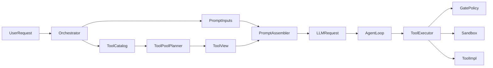

# TyClaw Reference Audit

This document captures the current architecture analysis of `../tyclaw2/rust_edition` with `claude-code` as the main reference point. It is intended as a working memo for future improvements, not an implementation spec.

## Executive Summary

`TyClaw` already has a solid Rust-side skeleton:

- tool ABI
- tool registry
- executor
- gate / RBAC
- sandbox integration
- orchestrator
- context builder
- agent loop

Compared with `claude-code`, the main weakness is not runtime execution, but the layers before execution:

- tool visibility is not clearly separated from tool execution permission
- prompt inputs are modular, but not fully split by semantic source
- runtime, definition, subtask, and consolidation views do not yet come from one unified source of truth

The most valuable thing to reuse from `claude-code` is the design principle, not its exact implementation.

## Key Comparison

### 1. Tool System

`claude-code` effectively separates:

1. registered tools
2. visible tool pool for the current request
3. execution path and permission checks

`TyClaw` currently leans more toward:

1. register tools in `ToolRegistry`
2. expose nearly all registry definitions to the model
3. enforce permission mainly at execution time

Relevant files:

- `crates/tyclaw-tools/src/base.rs`
- `crates/tyclaw-tools/src/registry.rs`
- `crates/tyclaw-tools/src/executor.rs`
- `crates/tyclaw-control/src/gate.rs`
- `crates/tyclaw-orchestration/src/builder.rs`
- `crates/tyclaw-agent/src/agent_loop.rs`

### 2. Prompt Construction

`claude-code` is strongest at treating prompt assembly as multiple semantic layers:

- `systemPrompt`
- `userContext`
- `systemContext`

`TyClaw` already has a good modular prompt builder, including:

- `Identity`
- `Bootstrap`
- `Memory`
- `DateTime`
- `Capabilities`
- `Skills`
- `Cases`
- `[[CACHE_BOUNDARY]]`

But these layers are still mostly organized as prompt sections, not yet as distinct semantic sources with stable policy around:

- what is stable across requests
- what is user/project memory
- what is request-time runtime state
- what belongs in system vs user vs metadata messages

Relevant files:

- `crates/tyclaw-prompt/src/context.rs`
- `crates/tyclaw-orchestration/src/orchestrator.rs`
- `crates/tyclaw-agent/src/agent_loop.rs`

## Current Strengths in TyClaw

### Tooling and Runtime

- `Tool`, `ToolRuntime`, and `ToolDefinitionProvider` are already decoupled at the trait level.
- `FullToolExecutor` cleanly isolates execution middleware from tool implementations.
- sandbox capability is already designed as an ABI concern, not hard-coded into tools.
- `Orchestrator` is a proper integration point rather than letting prompt logic leak everywhere.
- sub-agents are real runtime units, not just prompt tricks.

### Prompting

- `ContextBuilder` has meaningful section boundaries.
- stable prefix caching already exists.
- `[[CACHE_BOUNDARY]]` is the right idea.
- dynamic retrieval and memory are not mixed blindly into one raw system string.
- history repair logic exists and is practical.

## Main Gaps to Improve

### 1. Tool Visibility Happens Too Late

Today, `TyClaw` mostly decides "can this run?" at execution time, not "should the model even see this tool?" before request assembly.

Symptoms:

- models can see tools that may always be denied for the current role
- token budget is spent on tool definitions that are not actually usable
- the model can learn bad behavior by repeatedly trying denied tools
- subtask/main/consolidation views can drift

What to learn from `claude-code`:

- build a request-specific tool pool first
- derive API schemas from that pool
- keep execution enforcement as a later layer, not the first filtering layer

### 2. Gate Policy Is Too Coarse

Current `GatePolicy` is effectively based on:

- `tool_name`
- `risk_level`
- `user_role`

That is enough for coarse RBAC, but not enough for realistic policy decisions such as:

- path-based file restrictions
- command-level shell restrictions
- network restrictions
- subtask-only tool restrictions
- request-mode restrictions

What to improve:

- move from risk-only gating to argument-aware and context-aware gating
- let tool visibility and gate policy share the same policy inputs

### 3. Prompt Sections Need Semantic Labels

`ContextBuilder` is already good structurally, but the next step is not "more sections". The next step is stronger metadata for each prompt input:

- source kind
- cache level
- audience
- placement strategy

Suggested semantic buckets:

- stable system policy
- workspace or project memory
- dynamic runtime state
- retrieval context
- tool guidance

This will make future changes easier than continuing to add more string-building branches.

### 4. One Source of Truth Is Missing

The clearest architectural gap is that `TyClaw` has multiple tool views assembled in different ways:

- runtime registry
- definition registry
- subtask registry
- consolidation path using definition registry

Relevant behavior:

- `build_runtime_registry(...)` can register `dispatch_subtasks`
- `build_definition_registry(...)` does not fully mirror the runtime view
- sub-agents build their own registry with `register_core_tools(...)`
- consolidation uses `tool_defs_registry.get_definitions()`

This is workable, but becomes fragile over time.

The architecture should evolve toward:

- one tool catalog
- one policy-driven pool planner
- multiple exported views for different consumers

## Concrete Design Direction

### A. Introduce a Tool Pool Layer

Add a layer conceptually between registration and API schema export:

1. `RegisteredTools`
2. `VisibleToolPool`
3. `ExecutableToolRuntime`

Possible meanings:

- `RegisteredTools`: every implemented tool in the binary
- `VisibleToolPool`: tools exposed to the model for this request
- `ExecutableToolRuntime`: tools actually executable after gate and environment checks

This is the single most important change to align with the strongest part of `claude-code`.

### B. Unify Tool Views Across Contexts

Instead of maintaining separate hand-assembled registries, derive views from a common planner.

Desired consumers:

- main agent
- sub-agent
- consolidation
- maybe future planner/reducer agents

Suggested conceptual API:

- `ToolCatalog`
- `ToolPoolPlanner`
- `ToolView`

For example:

- `for_main_agent(...)`
- `for_subtask_agent(...)`
- `for_consolidation(...)`
- `for_prompt_only(...)`

### C. Evolve Prompt Builder Inputs

Instead of passing many optional arguments into `ContextBuilder`, move toward a structured input object.

Suggested direction:

- `PromptInputs`
- `StablePolicyContext`
- `WorkspaceMemoryContext`
- `RuntimeStateContext`
- `RetrievalContext`
- `ToolGuidanceContext`

This does not mean rewriting all prompts. It means changing the internal representation so prompt assembly is easier to reason about and cache.

### D. Add Dynamic Tool Guidance

Many tools currently expose only:

- `description()`
- `parameters()`

That is enough for OpenAI-compatible schema transport, but weak for agent quality.

Claude Code tools effectively carry usage guidance such as:

- when to use this tool
- when not to use it
- common pitfalls
- parameter expectations
- relationship to other tools

For `TyClaw`, this would be most useful first for:

- `exec`
- `read_file`
- `write_file`
- `edit_file`
- `ask_user`
- `dispatch_subtasks`

### E. Make Confirm and AskUser Real Runtime States

Two current mismatches should be treated as temporary shortcuts, not stable architecture:

- `GateAction::Confirm` is treated like allow in `FullToolExecutor`
- `ask_user` is auto-replied in `tool_runner`

That means the type system already knows these states exist, but the runtime loop does not fully honor them yet.

Longer-term goal:

- `Visible`
- `Executable`
- `NeedsConfirmation`
- `NeedsUserInput`
- `Denied`

All tool lifecycle logic should converge around those states.

## Things Not Worth Copying From Claude Code

### 1. Multiple Inconsistent Execution Entrypoints

Do not copy the behavior drift between different execution paths. `TyClaw` should keep a single execution authority as long as possible.

### 2. Complex Multi-Source Memory Includes

Do not rush into a `CLAUDE.md`-style include graph unless there is a real product need for:

- org memory
- user global memory
- project memory
- local overrides

For now, `workspace/*.md + memory/MEMORY.md + cases + skills` is enough.

### 3. Deferred Tool Search

Do not add a `ToolSearchTool` equivalent early. The immediate value is much lower than:

- fixing tool visibility
- unifying tool views
- improving prompt input semantics

## Recommended Order of Work

### Phase 1: Visibility and Drift Audit

First identify:

- which tools are visible but practically non-executable
- where runtime and definition registries diverge
- where sub-agents and consolidation see a different tool world than the main loop

Primary files:

- `crates/tyclaw-orchestration/src/builder.rs`
- `crates/tyclaw-orchestration/src/subtasks/executor.rs`
- `crates/tyclaw-agent/src/agent_loop.rs`

### Phase 2: Unified Tool Pool

Introduce a common tool-pool planning layer so all request paths derive from the same catalog and the same policy inputs.

Goal:

- no more hand-maintained parallel registry stories

### Phase 3: Structured Prompt Inputs

Refactor prompt assembly inputs from ad hoc optional fields into a structured representation with semantic categories.

Goal:

- stable policy
- workspace memory
- runtime metadata
- retrieval
- tool guidance

all become explicit inputs rather than accidental string fragments.

### Phase 4: Interactive Runtime States

Only after the previous layers are clean should `TyClaw` fully implement:

- confirmation flow
- real `ask_user` pause/resume behavior
- argument-aware gates
- subtask-specific tool visibility policies

## Near-Term Priorities

If the goal is to improve `TyClaw` quickly without touching everything, the best near-term focus is:

1. prompt architecture and prompt content
2. tool completion plus dynamic filtering
3. context compression strategy

Everything else can wait.

### Priority 1: Prompt Architecture and Prompt Content

This should come first because prompt quality currently limits tool use quality, phase transitions, and output discipline more than missing advanced runtime features.

The most valuable reuse from `claude-code` is:

- semantic separation of prompt inputs
- stronger tool-usage guidance
- clearer exploration vs production instructions
- stronger stopping rules for repeated searching and oversized outputs

For `TyClaw`, the first prompt-focused goal is not copying text line by line. It is rebuilding the prompt model around:

- stable system rules
- workspace and memory context
- runtime state
- tool guidance

After that, individual prompt wording can be upgraded by referencing the style and intent of `claude-code`.

### Priority 2: Tool Completion and Dynamic Filtering

Adding more useful tools matters, but exposing every tool blindly is not enough. Tool quality comes from both capability and visibility control.

Short-term priority:

- fill the core high-value tool set
- improve tool descriptions and usage hints
- introduce request-specific visibility filtering before schema export

This means `TyClaw` should move toward:

- `ToolCatalog`
- `VisibleToolPool`
- `ExecutableToolRuntime`

The filtering dimensions do not need to be over-engineered at first. The most useful initial inputs are:

- user role
- main agent vs sub-agent
- request mode
- current phase
- environment capabilities

### Priority 3: Context Compression Strategy

This should be done after prompt structure and tool visibility are cleaner; otherwise compression will mostly hide badly structured context instead of improving it.

The main compression work should focus on:

- tool output compression
- history trimming with pairing safety
- lightweight structured state snapshots

What matters most is preserving useful structure, not just shortening text.

### Lower Priority For Now

These areas are worth doing later, but should not block the three priorities above:

- full confirm / ask_user runtime state machine
- complex memory include systems
- deferred tool search
- deeper multi-agent architecture changes
- very fine-grained parameter-level policy

The expected fastest path to visible quality gains is:

1. improve prompt architecture and prompt text
2. improve tools and dynamic visibility
3. improve compression and context retention
4. revisit interactive runtime states later

## Architecture Sketch

## Reference Files

### Claude Code

- `src/tools.ts`
- `src/services/tools/toolExecution.ts`
- `src/context.ts`
- `src/utils/queryContext.ts`
- `src/utils/claudemd.ts`

### TyClaw

- `crates/tyclaw-tools/src/base.rs`
- `crates/tyclaw-tools/src/registry.rs`
- `crates/tyclaw-tools/src/executor.rs`
- `crates/tyclaw-control/src/gate.rs`
- `crates/tyclaw-prompt/src/context.rs`
- `crates/tyclaw-orchestration/src/builder.rs`
- `crates/tyclaw-orchestration/src/orchestrator.rs`
- `crates/tyclaw-orchestration/src/subtasks/executor.rs`
- `crates/tyclaw-agent/src/agent_loop.rs`

## Short Reminder For Future Work

If resuming this effort later, start with these questions:

1. What is the single source of truth for all implemented tools?
2. What is the request-specific visible tool set for the current user, mode, and agent scope?
3. Which prompt inputs are stable policy, which are memory, and which are request-time runtime state?
4. Are sub-agents and consolidation consuming the same architectural truth as the main agent?
5. Should this tool call be hidden, denied, paused, or executed?
