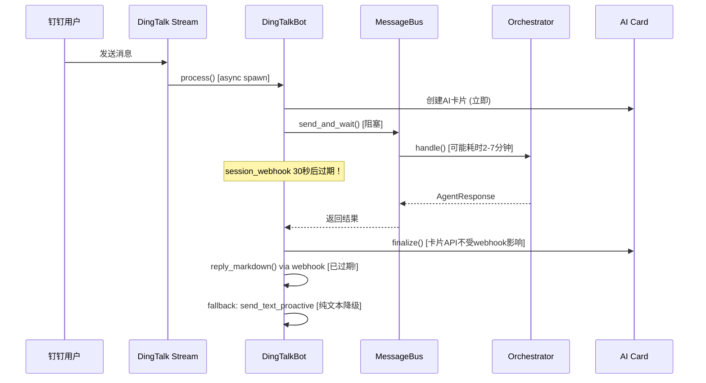
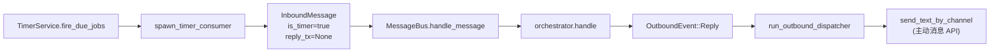

# 长耗时任务钉钉会话超时优化方案

> **日期**：2026-05-13
> **状态**：待实施
> **优先级**：P0（影响用户体验的核心问题）

## 一、问题描述

tyclaw 处理长耗时任务（2-7 分钟）时，钉钉 `session_webhook` 已过期，导致：
- 无法通过 webhook 回复用户
- 回退到纯文本主动消息，丢失 Markdown 格式
- 用户在长任务期间缺乏中间进度反馈

---

## 二、会话超时机制分析

### 2.1 钉钉 session_webhook

每条用户消息自带 `session_webhook` URL 和 `sessionWebhookExpiredTime`（Unix 毫秒时间戳）。

| 属性 | 值 |
|------|------|
| 有效期 | **约 30 秒**（钉钉官方文档） |
| 用途 | 免 token 快速回复（`reply_text` / `reply_markdown`） |
| 过期表现 | POST 返回非 200 或错误 body |

> **关键发现**：webhook 有效期仅 30 秒，远短于之前预估的 2 分钟。这意味着几乎所有需要 LLM 推理 + 工具调用的任务都会命中 webhook 超时。

### 2.2 两种回复通道对比

| 通道 | 时效 | 格式 | 依赖 |
|------|------|------|------|
| `session_webhook` | ~30 秒 | Text / Markdown | 消息自带 URL |
| 主动消息 API | 无限制 | Text / Markdown / File / Image | `access_token` + `robotCode` |

### 2.3 当前消息流



### 2.4 现有缓解机制及不足

| 机制 | 当前状态 | 不足 |
|------|---------|------|
| AI 卡片 | 已实现，创建后立即展示"思考中" | 卡片 TTL 30分钟够用；但只有 Thinking/Tool 两种 feed，无定时进度更新 |
| Heartbeat | 仅在第30轮迭代触发一次 | 太晚（约5分钟后），且只发一次，频率不够 |
| webhook fallback | `reply_markdown` 失败后 fallback 到 `send_text_proactive` | 只能发纯文本，丢失 Markdown 格式 |
| 定时任务回复 | 使用主动消息 API，完全不依赖 webhook | 已验证可靠，是参考模式 |

---

## 三、日志数据分析（2026-05-12）

### 3.1 请求耗时统计

当日 134 个完成请求中，至少 4 个子任务耗时超过 2 分钟：

| 任务 | 耗时 | 原因 |
|------|------|------|
| `refresh_and_render` | 436s (7.3min) | Tiger API 串行 + Playwright 渲染 |
| `contract_review_run` | 436s (7.3min) | 25次工具调用，13轮 LLM 交互 |
| `cost_report_in_progress` | 240s (4min) | 宜搭 API 慢 + 代码修复返工 |
| `cost_report_run` | 149s (2.5min) | 宜搭单次调用 48s |

### 3.2 SSE 超时统计

- 9 次 SSE chunk 超时（90s 无新数据），集中在上午高峰 09:35-11:52
- 每次超时导致额外 90-101 秒延迟（重连 + 重试）
- 超时期间用户无任何可见进度更新

### 3.3 session_webhook 影响评估

以 30 秒有效期计算：
- 134 个请求中，**绝大多数**会超过 30 秒（LLM 单次推理 + 工具调用通常 > 30s）
- 但因为 AI 卡片已启用，大部分场景已绕过 webhook 依赖
- 风险集中在：卡片创建失败、卡片 finalize 失败后的 fallback 路径

---

## 四、优化方案

### 方案 1：分级递进心跳机制（P0 — 核心）

**目标**：让用户在长任务期间持续收到进度反馈

**改动文件**：`crates/tyclaw-agent/src/agent_loop.rs`

**当前代码**（第 298-305 行）：

```rust
// 仅在第 30 轮发一次
if total_iterations == 30 {
    cb(ProgressEvent::Heartbeat(
        "[heartbeat]🦀 仍在处理中，请耐心等待...".into(),
    )).await;
}
```

**改为分级策略**：

| 条件 | 触发时机 | 消息内容 |
|------|---------|---------|
| 轮次 == 10 | 约 1-2 分钟 | "🦀 正在分析处理中..." |
| 轮次 == 20 | 约 3-4 分钟 | "🦀 仍在努力处理中，请耐心等待..." |
| 轮次 % 20 == 0 且 > 20 | 每 20 轮 | "🦀 复杂任务仍在处理中（已执行 {N} 轮）..." |

**新增时间兜底心跳**：

- 在 agent_loop 中维护 `last_heartbeat_time: Instant`
- 每次工具执行完毕后检查：距上次心跳超过 **90 秒**则自动发送
- 解决单轮因 SSE 超时、外部 API 慢调用卡住时无反馈的问题

**心跳去重**：轮次心跳和时间兜底心跳共享 `last_heartbeat_time`——任一心跳发出后立即重置计时器，避免两种心跳在短时间内接连触发。

**预期改动量**：约 25 行 Rust 代码

### 方案 2：主动消息 Markdown 回复（暂缓）

> **状态**：暂缓 — 长任务主要通过 AI 卡片回复，此方案仅在"卡片创建失败 → webhook 也过期"的极端路径触发，优先级降低。待方案 1 上线后评估是否需要。

**目标**：消除 webhook 过期后回复格式降级的问题

**改动文件**：
- `crates/tyclaw-channel/src/dingtalk/handler.rs` — 新增 `send_markdown_proactive`
- `crates/tyclaw-channel/src/dingtalk/bot.rs` — fallback 路径升级

**实现**：
- 钉钉主动消息 API 支持 `sampleMarkdown` msgKey
- 参数格式：`{"title":"xxx","text":"markdown内容"}`
- 在 bot.rs 中 webhook 失败后，优先使用 `send_markdown_proactive` 而非 `send_text_proactive`

**预期改动量**：handler.rs 新增约 50 行函数，bot.rs 修改约 10 行

### 方案 3：AI 卡片定时刷新（暂缓）

> **状态**：暂缓 — 方案 1 的心跳已通过 AI 卡片 feed 提供进度反馈，先观察效果再决定是否需要独立的卡片定时刷新。

**目标**：防止用户在长任务期间感觉卡片"卡住了"

**改动文件**：
- `crates/tyclaw-channel/src/dingtalk/ai_card.rs` — 新增 `feed_elapsed` 方法
- `crates/tyclaw-app/src/main.rs` — dispatcher 定期调用

**实现**：
- `feed_elapsed(elapsed_secs: u64)` 在卡片底部追加耗时信息
- dispatcher 每 **60 秒**扫描活跃卡片，调用 `feed_elapsed`
- 用户看到 "⏱ 已处理 2 分钟..." 不断更新，确认任务仍在运行

**预期改动量**：约 40 行

### 方案 4：Outbound Dispatcher 保底心跳（暂缓）

> **状态**：暂缓 — 长任务主要通过 AI 卡片回复，方案 1 的分级心跳已覆盖主要场景。若后续发现 agent_loop 卡住导致卡片长时间无更新，再启用此方案。

**目标**：即使 agent_loop 内部卡住，也能给用户发送进度提示

**改动文件**：`crates/tyclaw-app/src/main.rs`

**实现**：
- 利用 `Orchestrator.active_tasks` 注册表
- dispatcher 循环中增加定时扫描：超过 90 秒无 outbound 事件的钉钉任务自动发一条提示
- 通过 `send_text_by_channel` 主动 API 发送

**预期改动量**：约 30 行

### 方案 5：提前释放 webhook 回复配额（P2）

**目标**：在 webhook 过期前尽早使用一次

**改动文件**：`crates/tyclaw-channel/src/dingtalk/bot.rs`

**实现**：
- 有 AI 卡片场景：最终结果通过卡片 `finalize` 返回，webhook 不再需要
- 无 AI 卡片场景：任务开始时**立即**通过 webhook 发一条"收到，正在处理..."，最终结果走主动消息 API

**预期改动量**：约 15 行

---

## 五、实现优先级

按收益/工作量排序：

| 优先级 | 方案 | 收益 | 工作量 | 状态 |
|--------|------|------|--------|------|
| **P0** | 分级心跳 | 直接改善用户等待体验 | 小（~25 行） | **待实施** |
| ~~P0~~ | ~~主动消息 Markdown~~ | ~~消除格式降级（卡片失败时的兜底）~~ | ~~小（~60 行）~~ | 暂缓 |
| ~~P1~~ | ~~卡片定时刷新~~ | ~~视觉持续反馈~~ | ~~中（~40 行）~~ | 暂缓 |
| ~~P2~~ | ~~Dispatcher 保底心跳~~ | ~~兜底保障~~ | ~~中（~30 行）~~ | 暂缓 |
| P2 | 提前释放 webhook | 边际改善 | 小（~15 行） | 待评估 |

---

## 六、参考：定时任务的主动响应模式

定时任务是已验证可靠的**不依赖 session_webhook** 的响应模式：



**关键差异**：
- 普通消息：`send_and_wait`（oneshot 回传）→ bot.rs 用 `session_webhook` 回复
- 定时任务：`reply_tx=None`（fire-and-forget）→ dispatcher 用主动 API 回复

优化核心：让长耗时普通任务的**最终回复**也走主动 API 路径。

---

## 七、涉及文件清单

| 文件 | 改动类型 | 说明 | 关联方案 |
|------|---------|------|---------|
| `crates/tyclaw-agent/src/agent_loop.rs` | 修改 | 分级心跳 + 时间兜底心跳 | 方案 1 |
| ~~`crates/tyclaw-channel/src/dingtalk/handler.rs`~~ | ~~新增函数~~ | ~~`send_markdown_proactive`~~ | ~~方案 2（暂缓）~~ |
| ~~`crates/tyclaw-channel/src/dingtalk/bot.rs`~~ | ~~修改~~ | ~~fallback 使用 Markdown~~ | ~~方案 2（暂缓）~~ |
| ~~`crates/tyclaw-channel/src/dingtalk/ai_card.rs`~~ | ~~新增方法~~ | ~~`feed_elapsed` 定时刷新~~ | ~~方案 3（暂缓）~~ |
| ~~`crates/tyclaw-app/src/main.rs`~~ | ~~修改~~ | ~~dispatcher 定时心跳扫描~~ | ~~方案 3+4（暂缓）~~ |

---

## 八、风险评估

| 风险 | 概率 | 影响 | 缓解措施 |
|------|------|------|---------|
| 心跳消息过于频繁，用户觉得烦 | 低 | 低 | 控制在最多每 90 秒一条 |
| 主动消息 API 触发钉钉限流 | 低 | 中 | 钉钉单聊限流 20 条/分钟，心跳远低于此 |
| 卡片 streaming API 偶发失败 | 中 | 低 | 已有 warn 日志 + finalize fallback |
| 并发任务心跳消息交叉 | 低 | 低 | 心跳按 chat_id 隔离，不会串 |

---

## 九、验证方案

1. **单元测试**：心跳触发条件的逻辑测试（轮次 + 时间双条件）
2. **集成测试**：模拟 > 30s 任务，验证 webhook 过期后 Markdown fallback 成功
3. **线上验证**：部署后观察日志中 `send_markdown_proactive` / `heartbeat` 的调用频率和成功率
4. **用户反馈**：关注长任务场景下用户是否仍报告"无响应"
