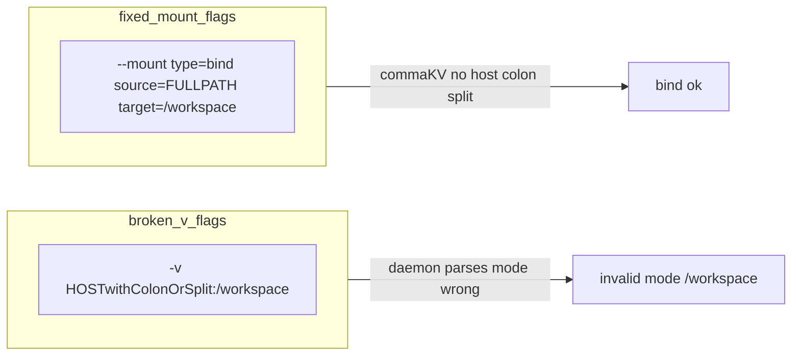

# 修复 Docker `invalid mode: /workspace`（`-v` 解析问题）

> **Superseded by**: `.cursor/plans/workspace_路径嵌套修复_86cbebca.plan.md`
> （合并 slash 嵌套 + bind mount + `+ = :` 字符清洗 + 停机迁移脚本）
>
> 本文档保留作为历史归档；所有条款已在新计划中落地：
> - 「`--mount type=bind` 替换 `-v`」→ 新计划第 4 节 + `crates/tyclaw-sandbox/src/docker.rs::bind_mount()`
> - 「`docker_test.rs` 条件性集成测试」→ `test_docker_acquire_with_base64_chat_id_key`
> - 「`workspace_key` 文件系统别名/清洗」（原文档免责声明）→ 已被
>   `tyclaw_control::filesystem_workspace_leaf` 覆盖（清洗 `/ \ : + =`）
> - 配套停机迁移脚本：`scripts/migrate_works_chars.sh`

> 来源：Cursor 计划「Docker --mount bind fix」  
> 保存日期：2026-05-17  

## 根因对齐

Docker 的经典 `-v host:dst[:opts]` 在 **Unix** 上对 **host 路径中的冒号 `:`** 不可靠：拆分器会把本应属于路径的 `:` 当成 `host`/中间段/`mode` 的分界符，从而让 **`/workspace` 一类的片段落到「mode」位**，报错 **`invalid mode: /workspace`**。

本项目中，工作区宿主机路径由 [`workspace_path`](../../crates/tyclaw-control/src/workspace.rs) / [`DockerPool::workspace_path`](../../crates/tyclaw-sandbox/src/docker.rs) 组装，**直接把 `workspace_key` 用作目录名**（`works/{bucket}/{workspace_key}`）。若 `workspace_key` 中带 `:`（或其它未来难以预料的 `-v` 不友好字符），就高度符合上述故障模式。

挂载构造当前集中在 [`DockerPool::create_workspace_container`](../../crates/tyclaw-sandbox/src/docker.rs)（约 `mount_arg`、`global_*_mount`、`defaults_mount`、`/etc/localtime`）。

## 推荐实现（主修复）

### 1. 用 `--mount type=bind` 替代所有相关 `-v`

在 `docker run` 参数列表中：

- **主挂载**（原 `{ws_root}:{mount_root}`）：改为形如  
  `type=bind,source=<abs>,target=<mount_root>`（无 `readonly`，与当前 rw 行为一致）。
- **全局 skills / tools / defaults.py**：原 `:ro`，改为 **`readonly`**（或等价 `ro`，以 Docker CLI 与本机 Docker 版本实测为准）。
- **`/etc/localtime`**（原 `-v ...:ro`）：同样改成 `type=bind,source=...,target=...,readonly` 以保持行为一致。
- **`--user`（若启用）**/其它不变参数照旧。

关键点：

- **`source`** 与 **`target`** 必须是 **Docker 认定的绝对路径**；你们已对 `ws_root`、全局目录、`defaults.py` 做了 [`canonicalize`](../../crates/tyclaw-sandbox/src/docker.rs) 或等价回退——保持/abs 优先，避免因相对路径再引入另一类解析歧义。
- 将 `--mount ...` **拆成两个 argv 元素**（`"--mount"` 与单行 spec），与当前 `-v` 写法保持一致风格，便于审计。

建议在 `docker.rs` 内封装小函数，例如 **`bind_mount(spec_source: impl AsRef<Path>, target: &str, readonly: bool) -> String`**，集中格式化 spec，避免五处手写格式漂移。

### 2. Docker spec 编码细节（须在实现时用一次真机/docker 校验）

CLI 挂载 spec **用逗号分隔键值**。若 **`source`** 中存在 **逗号**（极少见于正常路径但仍可能），需要根据 Docker/Moby 支持的转义约定处理；若你们场景仅限常见 Unix/macOS path，可先实现无前导转义的版本并用测试覆盖 **`:`**。若你希望防御性满分，可把「路径含逗号」时的策略写进注释（或与运维约定禁止）。

### 3. 回归验证

- **自动化（优先）**：在 [`docker_test.rs`](../../crates/tyclaw-sandbox/tests/docker_test.rs) 增加一例 **仅当在当前 OS 能在临时目录创建带 `:` 的目录名时才运行**（`#[cfg(...)]` 或运行时 `mkdir` 失败则 `return`/`ignore`）：对 `DockerPool::acquire` 走一圈 **create container + 简单 exec**。
- **本地冒烟**：在项目目录执行现有的 `cargo test -p tyclaw-sandbox --test docker_test`（需 Docker + 镜像）。
- （可选）在文档或 PR 描述中记录：**不再依赖 `-v` 解析，`workspace_key` 中允许 `:` 不再触发同类 Docker 挂载错误**。

## 不包含在本计划内（可作后续）

- **`workspace_key` 文件系统别名/清洗**：从根目录名上禁止 `:` 可进一步降低别处（非 Docker）工具的坑，但与「挂载串」正交；若你希望强约束目录名字符集，可另开议题统一 `workspace_path` 语义与迁移脚本。
- **`/user` vs `/workspace` 文档与代码漂移**：文件中仍有「挂到 `/user`」的早期描述，可按需单独对齐文档。

## 风险与回滚

- 风险：**老版本 Docker CLI** 对 `--mount` 的参数名（`readonly`/`ro`、`dst`/`target`）兼容性；建议在目标部署环境跑一次 `docker run --mount ... hello-world` smoke。
- 回滚：**仅改 `docker run` flag 拼装**，不涉及业务协议；若异常，恢复原 `-v` 分支即可。

## 执行清单（Checklist）

- [ ] 在 `docker.rs` 中实现 bind_mount spec 生成器，并把 `create_workspace_container` 内所有 `-v` 替换为 `--mount type=bind,...`（含 localtime/skills/tools/defaults/work 树）
- [ ] 对照本仓库目标 Docker 版本校验 mount 关键字（readonly vs ro、target vs dst），必要时用一次最小 `docker run` smoke
- [ ] 在 `docker_test.rs` 增加条件性集成测试（目录名允许 `:` 时）覆盖「曾触发 invalid mode」的路径形态
- [ ] 运行 `cargo test -p tyclaw-sandbox --test docker_test` 与会触发 `create_workspace_container` 的一轮本地启动验证
