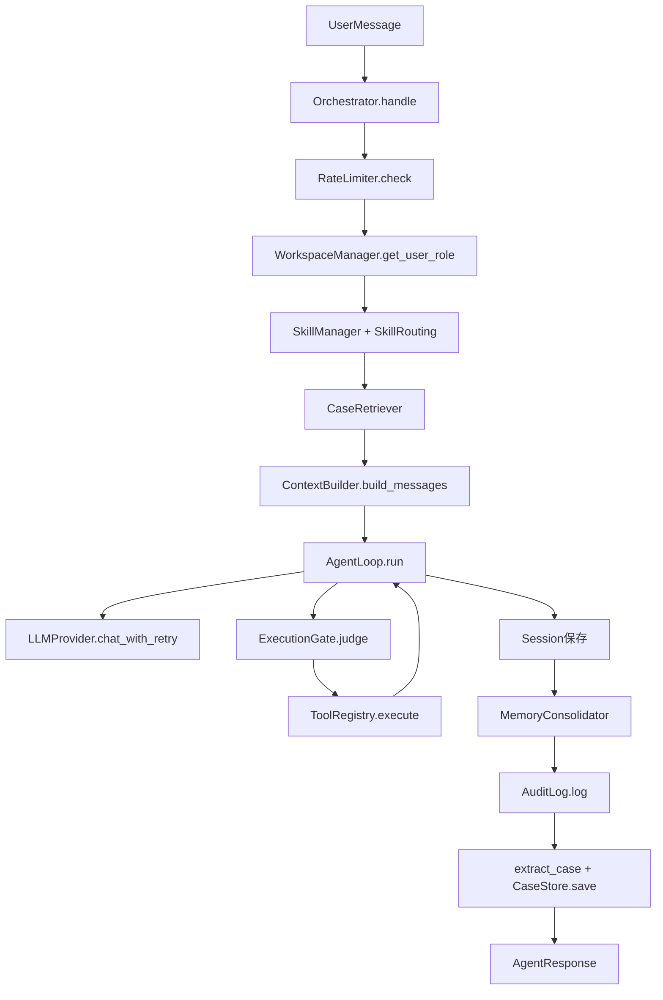

# TyClaw Rust ReAct 技术分析报告

## 范围说明
- 代码基线：`tyclaw2/rust_edition`
- 关注重点：核心 ReAct 循环、分层架构、数据流程、关键算法、优化空间

## 分层架构设计

- **启动层（tyclaw-app）**
  - 读取配置、初始化 provider、创建 orchestrator、启动 CLI / DingTalk。
- **编排层（tyclaw-orchestration）**
  - 负责请求全生命周期：限流、角色、会话、技能、案例、运行时调用、审计、记忆合并。
- **执行层（tyclaw-agent）**
  - `AgentLoop` 实现 ReAct 迭代状态机，`ContextBuilder` 负责消息和系统提示组装。
- **工具层（tyclaw-tools）**
  - `ToolRegistry` 管理工具定义与执行，内置文件工具 + `exec`。
- **控制层（tyclaw-control）**
  - RBAC、ExecutionGate、Workspace、Audit、RateLimiter。
- **记忆层（tyclaw-memory）**
  - token 预算驱动的合并、案例提取和检索。
- **模型层（tyclaw-provider）**
  - LLM 调用与重试策略（指数退避）。

## 端到端数据流程



## 核心算法逻辑

### 1) ReAct 主循环（AgentLoop）
- 每轮向 LLM 发送当前完整消息 + 工具定义。
- 若返回 `tool_calls`：
  - 记录 assistant/tool_call 消息；
  - 对每个调用做 gate 判定；
  - 执行工具并写回 tool result；
  - 进入下一轮。
- 若无 `tool_calls`：
  - 优先读取 `loop_control` 协议字段决定是否结束循环。
- 超过 `max_iterations` 强制终止并返回提示。

### 1.1) loop_control 协议（已实现）

当前 Rust 版本已实现显式循环控制协议，避免仅靠自然语言判断“任务是否结束”。

- Provider 层：
  - `LLMResponse` 已包含 `loop_control` 字段。
  - 兼容两种输入格式：
    - 顶层字段 `loop_control`
    - `content` 中 JSON（如 `{"loop_control": ..., "final_answer": ...}`）
- AgentLoop 行为：
  - `loop_control.status = done`：结束循环，优先返回 `final_answer`，无则回退 `reason`
  - `loop_control.status = continue`：继续下一轮
  - 与“重复 tool batch / 无进展轮次”保护协同工作，避免空转

协议示例：

```json
{
  "loop_control": { "status": "done", "reason": "task completed" },
  "final_answer": "已完成处理。"
}
```

### 2) 技能路由（编排层）
- 先按 query 与 `triggers` 的包含关系筛选候选 skill。
- 对候选按 `requires_capabilities` 递归补齐依赖 skill。
- 若无命中则回退全量技能注入（兼容策略）。

### 3) 记忆合并（token 预算）
- 使用 `estimate_prompt_tokens_chain` 估算 prompt token。
- 超窗后按 user-turn 边界切 chunk 合并到记忆。
- 最多执行 `MAX_ROUNDS=5` 轮以防无限合并。

### 4) Provider 重试
- `1s -> 2s -> 4s` 指数退避 + final attempt。
- 通过错误文本关键字识别 transient error。

## ReAct 提示词拼接优化（已落地）

本轮已围绕“上下文构建热路径”完成一组可直接生效的优化，重点是减少无效 token、降低重复拼接开销、提升命中质量。

### P0/P1：去重与预算裁剪

- **历史消息去重**：
  - 连续重复消息去重。
  - 非 user 角色的重复块去重（避免 tool/assistant 冗余历史反复进入 prompt）。
- **历史 token 预算裁剪**：
  - 从最新消息向前保留，按 token 预算截断。
  - 默认按 `context_window` 比例分配，并设置最小预算下限。
- **similar cases 去重与限长**：
  - 对案例提示做行级去重。
  - 超过阈值后截断，避免案例段吞噬主问题 token。
- **skills 注入降噪**：
  - 路由后技能正文注入设置上限（不是全量灌入）。
  - 优先保留高相关技能，减少 system prompt 体积。

### P2：稳定前缀缓存命中

- 在 `ContextBuilder` 中引入**稳定前缀缓存**：
  - 缓存内容：`identity + bootstrap files + MEMORY.md`。
  - 命中条件：workspace 和相关文件指纹（mtime + size）不变。
  - 失效机制：任一关键文件变化自动重建前缀。
- 收益：
  - 减少每轮反复读文件与大字符串拼接。
  - 在多轮 ReAct 场景中显著降低上下文构建成本。

### 动态上下文预算（新增）

在编排层新增 query 驱动的预算规划器（`ContextBudgetPlan`），不再固定配额：

- **排障类 query**：提高 cases 预算，降低技能注入。
- **连续追问类 query**：提高 history 预算，降低 cases 预算。
- **实现/改代码类 query**：提高 skills 预算，history 保持中等。

该策略目前采用轻量关键词分类 + 配额 clamp，优点是简单稳定、易调参。

### 验证状态

- 已完成 `cargo check` 编译验证。
- 关键缓存刷新路径已补单测（`MEMORY.md` 变化触发缓存失效并重建）。

## 关键技术问题（当前状态）

### 已落地（相对前版本）
- 多工具调用已支持并发执行（`join_all`），并保持结果回写顺序。
- 循环层已支持“重复工具批次”和“无进展轮次”停机保护。
- `loop_control` 显式循环控制协议已打通（provider 解析 + agent 执行）。
- 提示词拼接已引入去重、预算裁剪、稳定前缀缓存与动态预算策略。
- `builtin_capabilities` 过滤链路已在编排层生效。

### 仍待改进（建议优先）
- `JudgmentAction::Confirm` 仍与 `Allow` 同执行路径，缺少真正的人机确认回合。
- `AgentLoop` 每轮仍对 `messages` 做 clone（调用 provider 时），长会话仍有拷贝开销。
- 当前动态预算为规则驱动（关键词），尚未引入可学习的效果反馈调参。
- Session 仍以整文件重写为主，极长历史下 I/O 成本仍可优化。
- tool definitions 每轮随请求发送，尚未做协议层缓存协商（取决于上游模型 API 能力）。

## 优化空间与建议

### 短期（低风险）
- 落地真实 `confirm` 回合（拦截 dangerous 调用并等待用户确认 token）。
- 减少循环中的消息 clone（例如共享消息缓冲 + 增量 append 视图）。
- 将动态预算阈值外提到 `config.yaml`，便于线上调参。
- 继续强化工具结果结构化（目前已支持 error envelope，可补充 code/retryable 字段）。

### 中期（中等改动）
- skill 路由升级为更稳的打分模型（trigger + tags + category + query token + 会话状态）。
- 引入 prompt 构建观测指标（history/cases/skills 占比、截断量、命中率）。
- 缓存 tool defs token 与近期 prompt token 估算结果，减少重复估算开销。

### 中长期（体系化）
- 拆分 Planner / Executor，降低无效回合。
- 引入 tool DAG 执行模型支持依赖并发。
- 建立迭代级观测指标（轮次耗时、工具耗时、token 增长、失败分类）。

## 总结
- 当前 Rust 架构层次清晰，可演进性好。
- ReAct 主链路完整，但在“循环热路径性能”和“决策稳定性”上仍有明显优化空间。
- 优先建议：并发工具执行、减少全量复制、强化路由与停机保护。

## SDK 化接入（新增）

当前已支持将编排层作为库嵌入其他工具，不依赖 CLI 或钉钉接入层。

- 新增 `OrchestratorBuilder`：可按需注入工具注册表、开关审计/记忆/RBAC/限流。
- 新增 `RequestContext`：统一传递 `user_id/workspace_id/channel/chat_id`。
- 保持兼容：原有 `Orchestrator::new` 和 `handle` 仍可继续使用。

示例文件：

- `crates/tyclaw-orchestration/examples/sdk_demo.rs`

运行方式（示例）：

```bash
cd tyclaw2/rust_edition
OPENAI_API_KEY=your_key cargo run -p tyclaw-orchestration --example sdk_demo -- "请列出当前目录下的 Rust 文件"
```

说明：

- `sdk_demo` 使用 `Builder + handle_with_context` 路径。
- 示例演示“外部工具注入”，仅注册 `read_file/list_dir` 两个只读工具。
- 若需替代 Cursor CLI，可在宿主系统中维护自己的会话/用户体系，只把请求上下文映射到 `RequestContext` 即可。
